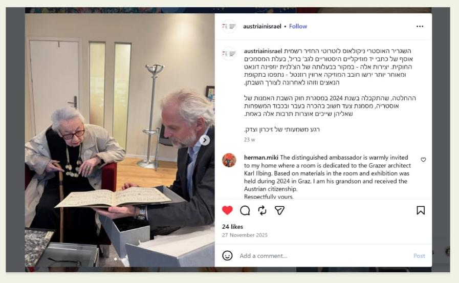
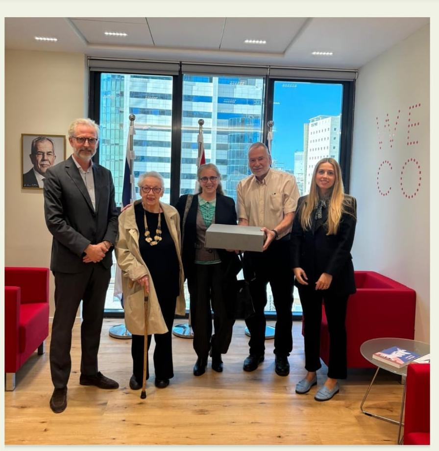
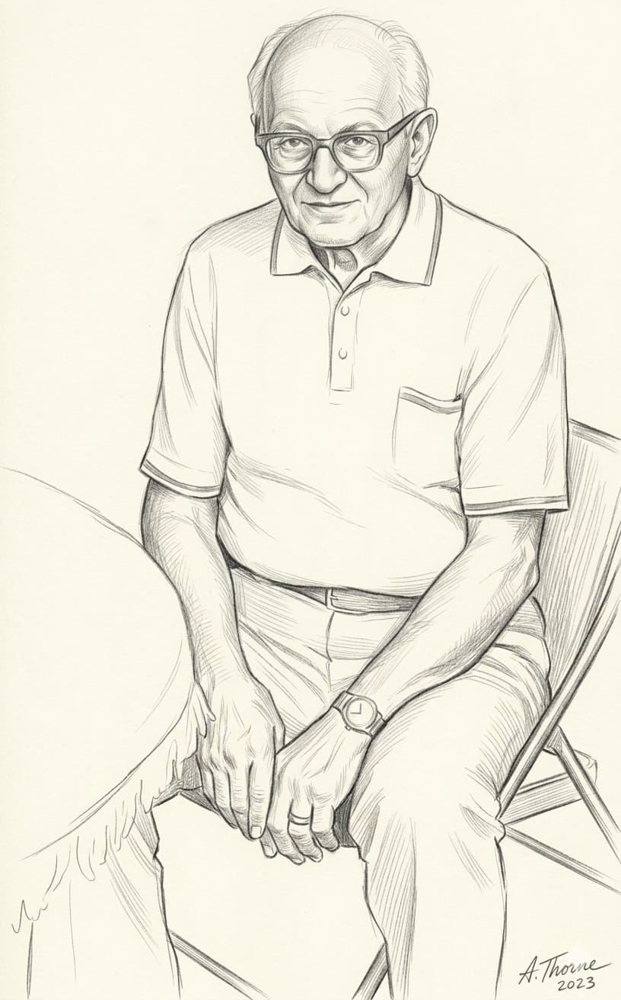
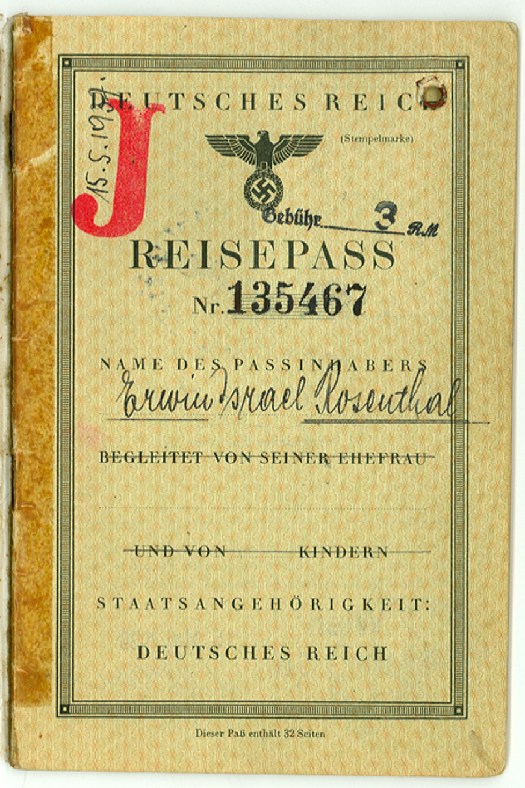

# סיפורה של משפחת פליקס רוזנטל  מווינה

בשנת 2026 במסגרת במאמץ להחזיר ליהודי אוסטריה את רכושם התרבותי, הודיעו חוקרים אוסטרים מהוועדה לחקר המקורות במשרד לאמנות ותרבות, כי מצאו את היורשים של המוזיקאים היהודיים מווינה והעבירו את אוסף התווים לשגריר אוסטריה בארץ והוא העבירם למשפחות מלניק ווייצנר.  

פליקס רוזנטל – Felix Rosenthal תאריך לידה: 2 באפריל 1867, היה פסנתרן, מלחין, ומורה למוזיקה וינאי מוערך, ובעלה של אליזבת (אלזה) רוזנטל לבית דונאט, ילידת 3 בנובמבר 1876. הם התגוררו ב- Vienna’s 8th district Josefstädter Straße 87 ברובע ה-8 של וינה.
בנם היחיד ארווין נולד ב- 19 בספטמבר 1906.

דודתו של ארווין, אחות אמו אליזבת, ג'וזפין דונט Josefine Donat, ילידת וינה 11 באוגוסט 1865, הייתה צ'לנית וינאית מוכרת. משפחת דונט התגוררה ברובע XVIII ה-18 Edelhofgasse 15. ג'וזפין נפטרה בגיל 71, ב-7 בדצמבר 1936 בבית החולים "קייזרין אליזבת" (Kaiserin-Elisabeth-Hospital) בווינה, והורישה את רכושה לאחיינה היחיד ארווין.
גיסה, פליקס רוזנטל, אביו של ארווין, נפטר אף הוא באותה עת ב-30 בדצמבר 1936, כשנתיים לפני כניסת הנאצים לאוסטריה.

לאחר סיפוח אוסטריה לגרמניה הנאצית (האנשלוס) ב-1938, החלו הנאצים לפנות בכוח את היהודים מדירותיהם המקוריות ברחבי וינה. ארווין איבד את עבודתו כמהנדס ונאלץ לברוח מווינה. ביוני 1939 הוא הצליח להימלט לאנגליה. באוקטובר 1939 הוא התחתן באנגליה עם ליצי (אליס Alice Grün) לבית גרון. ליצי וארווין הצליחו להשיג אישור הגירה לאחותה של ליצי שנותרה בווינה הנאצית עם בנה בן העשר הנס (חנן) וייצנר.  

אמו של ארווין, אליזבת (אלזה) רוזנטל. גורשה מדירתה ונשלחה בכפייה  ל"דירת ריכוז" (Sammelwohnung)  ברחוב רוטנשטרנגאסה Rotensterngasse 31, שברובע השני (לאופולדשטאט) בווינה. מקום זה היווה תחנה קריטית וטרגית בתהליך הנישול, הגירוש וההשמדה של יהודי העיר.  

ב-15.5.1942 גורשה אליזבת עם רבים מיהודי וינה לאיזביצה, קרסניסטב, לובלין, פולין. משם היא שולחה ככל הנראה למחנה ההשמדה סוביבור או בלזץ' ושם נרצחה בתאי הגזים. בת 66 הייתה במותה.
פרטי השילוח: שילוח 21 מווינה, מספר אסיר בשילוח: 652 פריט: 4940937 ושם 

בנה של אליזבת, ארווין, ואשתו ליצי היגרו בשנת 1949 לארצות הברית, התיישבו בנורוואק (Norwalk) שבקונטיקט. ארווין עבד כמהנדס מכני בין היתר על הטלסקופ האבל בנאס"א (NASA סוכנות החלל האמריקאית).  
רכושו וכתבי היד המוזיקליים של משפחתו נבזזו על ידי הגסטפו בווינה. ארווין וליצי היו חשוכי ילדים ונותרו כל השנים בקשר אמיץ וחם עם הנס (חנן) ומשפחתו שאותו הצילו למעשה מציפורני הנאצים.  
ארווין נפטר בקונטיקט, ארה"ב, בגיל 94, ב- 20 ביוני 2001). ליצי אשתו נפטרה בשנת 2008.  

הנס (חנן) וייצנר, אחיינו של ארווין, ושאר בשרו היחיד, נישא באנגליה לבריל לבית זבצקי. הזוג עלה בשנת 1953 ארצה והתיישב במושב הבונים. שתי בנותיהם בת-עמי וטלי היו אף הן בקשר חם עם ארווין וליצי – המצילים של אביהן.

